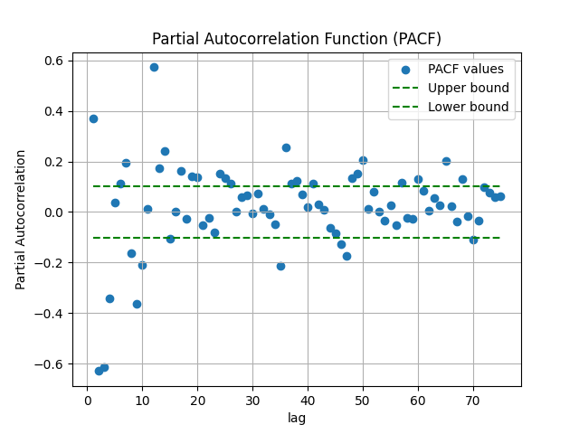
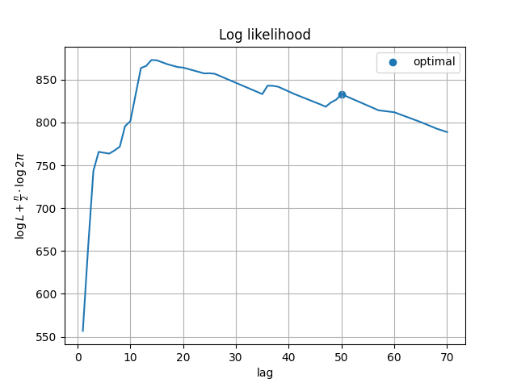
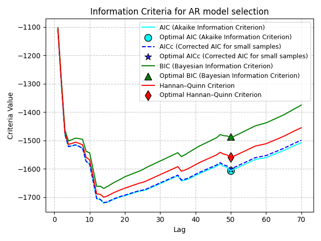
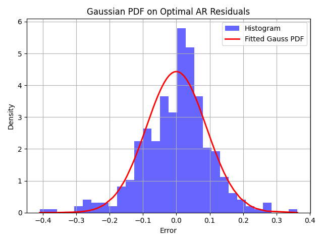
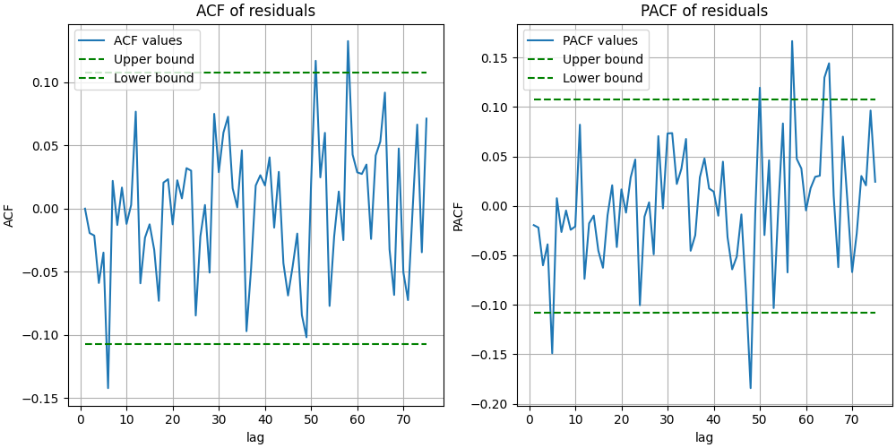
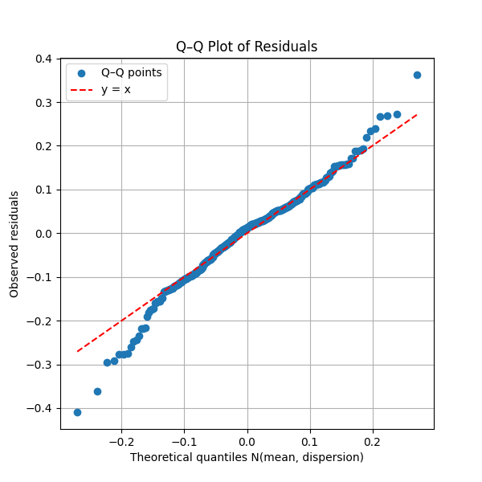
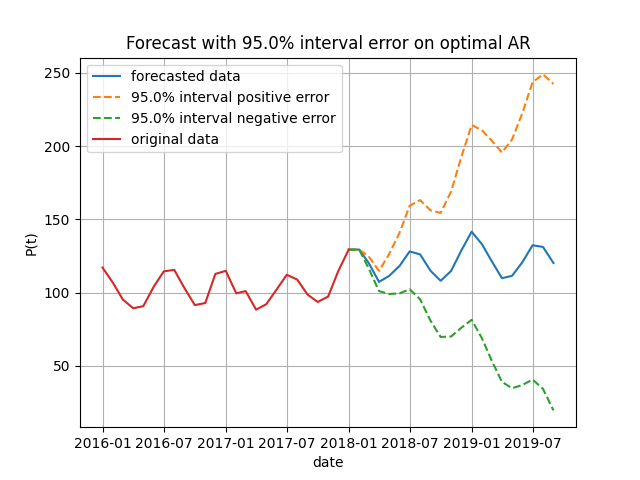

# AR-модель с автоматическим выбором лага и анализом распределения остатков

## 📌 Краткое описание

Реализация авторегрессионной модели (AR) временного ряда **полностью с нуля, без использования готовых моделей из библиотек**, на базовых инструментах NumPy, SciPy и pandas. В проекте реализован автоматический выбор лага по информационным критериям, а также вычисление функции правдоподобия для разных распределений ошибок — нормального (Гаусса) и распределения Стьюдента.

## 🎯 Цель проекта

- Построить интерпретируемую AR-модель на временном ряде производства электроэнергии.
- Автоматически определить оптимальное количество лагов.
- Проверить соответствие остатков нормальному распределению.
- Построить прогноз с доверительными интервалами.

---

## 📈 Подготовка данных

Исходный ряд представляет собой месячное производство электроэнергии. Для устранения тренда и стабилизации дисперсии использована логарифмическая производная (лог-дифференцирование):


---

## 🔍 Выбор лага модели

Необходимые лаги модели искались из коэффициентов частичной автокорреляционной функции (PACF). Значения, выходящие за доверительные границы ±2/√n (где n — длина ряда), считаются статистически значимыми и используются для построения модели.



Для дальнейшего уточнения модели реализован автоматический перебор значимых лагов с последовательным построением моделей с увеличивающимся числом лагов. Для каждой модели вычислялись информационные критерии (AIC, BIC, HQC), и выбиралась оптимальная модель с минимальным значением критерия.

Такой подход позволяет автоматизировать подбор параметров модели и избежать субъективного выбора, повышая точность и надёжность прогноза.

---

## 🧪 Сравнение моделей

Сравнивались модели AR с различными последовательными наборами лагов. В качестве критериев использовались логарифмическая функция правдоподобия, AIC, AICc, BIC и HQC:





Логарифмическая функция правдоподобия использовалась как основа для вычисления информационных критериев, а также позволяла сравнивать модели, построенные на разных распределениях ошибок.

---

## 📊 Распределение остатков

Для модели с наилучшими метриками построено распределение ошибок. Оно было аппроксимировано нормальным и распределением Стьюдента для оценки хвостов. На графике видно, что оба приближения дают схожие результаты:



Анализ автокорреляционной функции остатков не выявил значимых корреляций, что подтверждает, что модель успешно объясняет структуру временного ряда.



---

## 📐 Проверка нормальности остатков

Q–Q график показывает небольшие отклонения от нормального распределения в крайних хвостах. Основная масса точек лежит на диагонали, что указывает на соответствие нормальному распределению в центральной части:



---

## 🔮 Прогнозирование

На основе модели был выполнен прогноз на 20 месяцев вперёд. Построены доверительные интервалы с уровнем 95%:



---

## 🧪 Проверка автокорреляции остатков

Для оценки того, остались ли автокоррелированные зависимости в остатках модели, использовался тест Льюнга–Бокса. В результате статистически значимой автокорреляции выявлено не было, что подтверждает корректность выбора лагов и спецификации модели.

## 📋 Выводы из консоли

```plaintext
Ljung-Box test (max_lag=75):
  Q-statistic = 81.4938
  p-value      = 0.2844
  Автокорреляция остатков не значима (не отклоняем H0).

Сравнение эмпирического распределения остатков с теоретическими:
--------------------------------------------------------------------------------
Распределение         Среднее  Дисперсия  Скошенность    Эксцесс   KL divergence
--------------------------------------------------------------------------------
Эмпирическое           -0.000      0.090       -0.245      1.428             ---
Нормальное             -0.000      0.090        0.000      0.000           0.021
Стьюдента              -0.000      0.090        0.000      0.000           0.008
--------------------------------------------------------------------------------

```

## 🔎 Результаты и выводы
**Оптимальный лаг:** Автоматический подбор по информационным критериям (AIC, BIC, HQC) показал, что оптимальное число лагов составляет порядка 50, согласно значимым коэффициентам PACF и минимизации AIC/BIC.

**Распределение ошибок:** Остатки модели аппроксимируются нормальным распределением с небольшими отклонениями в хвостах, что подтверждается Q-Q графиком.

**Прогноз:** Модель успешно прогнозирует производство электроэнергии на 20 месяцев вперёд с доверительным интервалом 95%.

**Автокорреляция остатков:** Тест Льюнга-Бокса показал отсутствие значимой автокорреляции остатков, что говорит о корректной спецификации модели и адекватном подборе лагов.

**Ограничения:** Несмотря на хорошее соответствие модели данным, небольшие отклонения от нормальности в хвостах остатков могут указывать на редкие выбросы. Кроме того, модель AR ограничена в способности учитывать сезонные эффекты и другие сложные паттерны во временных рядах.

**Перспективы развития:** Для улучшения прогноза и учета сезонности стоит рассмотреть расширения модели до ARIMA или SARIMA, а также использовать более сложные методы выбора лагов и проверку устойчивости модели на разных временных интервалах.

## 📁 Как запустить

# Перед запуском вы можете настроить путь к данным, тип распределения, горизонт прогноза и другие параметры в config.yaml.

```bash
# Установите зависимости
pip install -r requirements.txt


# Запустите основной скрипт
python src/main.py
```

## 🚀 Запуск с аргументами командной строки (argparse)
Проект поддерживает настройку параметров через аргументы командной строки, что позволяет быстро переопределять значения из конфигурационного файла config.yaml без его редактирования.

**Пример запуска со стандартным конфигом:**

```bash
python src/main.py --config configs/config.yaml
```

**Пример запуска с переопределением параметров:**
```bash
python src/main.py --input_data_path src/data.csv --log_diff True --max_lag 30 --distribution student --forecast_steps 12 --confidence 0.9 --images_dir images/custom
```
**Описание доступных аргументов:**

| Параметр                        | Описание                                                  | Тип     | Пример         |
| ------------------------------- | --------------------------------------------------------- | ------- | -------------- |
| `input_data_path`               | Путь к CSV с исходными данными                            | `str`   | `src/data.csv` |
| `preprocessing.log_diff`        | Применять логарифмическую разность (`True` / `False`)     | `bool`  | `True`         |
| `model.model_type`              | Тип модели (пока только `AR`)                             | `str`   | `AR`           |
| `model.max_lag`                 | Максимальное число лагов для перебора                     | `int`   | `75`           |
| `model.distribution`            | Распределение ошибок (`gaussian` или `student`)           | `str`   | `gaussian`     |
| `model.lag_selection_criterion` | Критерий выбора лага модели (`AIC`, `AICc`, `BIC`, `HQC`) | `str`   | `AIC`          |
| `forecast.forecast_steps`       | Количество шагов прогноза вперёд                          | `int`   | `20`           |
| `forecast.confidence`           | Уровень доверительного интервала                          | `float` | `0.95`         |
| `images_dir`                    | Путь для сохранения графиков                              | `str`   | `../images`    |


## ⚙️ Конфигурация (config.yaml)

Конфигурационный файл содержит те же параметры, что и CLI, и используется по умолчанию, если не переопределён через аргументы командной строки.

## 📂 Структура проекта

<pre markdown="1">

project_root/
├── config/                  # Конфигурация проекта
│   └── config.yaml          # Конфигурационный файл
├── src/                     # Исходный код и данные
│   ├── main.py              # Главный скрипт запуска
│   ├── AR.py                # Модуль AR-модели
│   ├── distributions.py     # Распределения ошибок
│   ├── linear_dependence.py # Построение линейной зависимости
│   ├── stat_tests.py        # Статистические тесты
│   ├── Electric_Production.csv  # Исходные данные
│   └── ...                  # Другие вспомогательные файлы
├── images/                  # Графики и визуализации
│   ├── original and log_dif series.png
│   ├── PACF.png
│   ├── likelihood.png
│   ├── criterions.png
│   ├── pdf.png
│   ├── QQ.png
│   └── forecast.png
├── requirements.txt         # Зависимости проекта
└── README.md                # Текущий файл с описанием проекта

</pre>